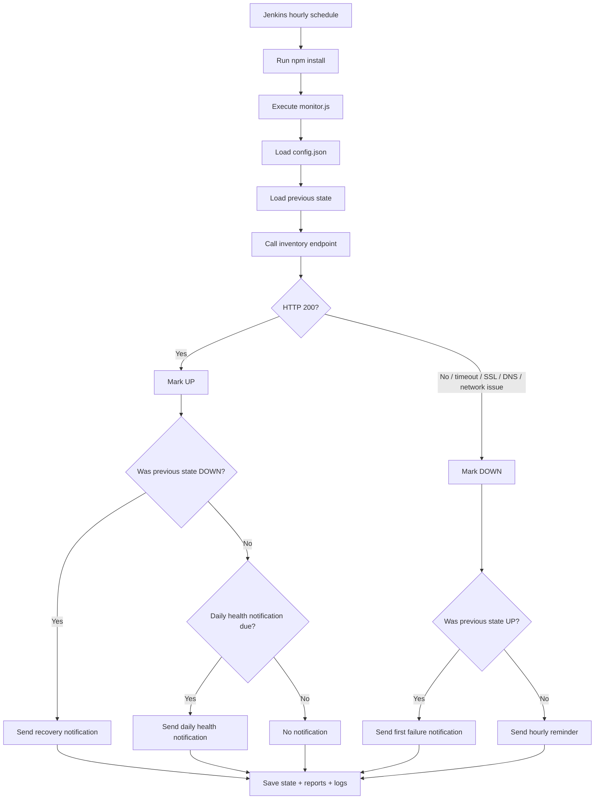

# Inventory Endpoint Monitor

A small Node.js monitoring project that checks one inventory endpoint on a schedule, records the result, and sends Microsoft Teams alerts only when the state changes or when a daily health reminder is due.

## What It Monitors

This project monitors only this endpoint:

`https://inutilidcplp322.idc1.level3.com:8483/hapi/inventory?all`

It does **not** parse the response body and does **not** inspect any internal APIs inside the inventory payload. The check is strictly endpoint-level health monitoring.

## Architecture Overview

- `src/monitor.js` is the main runner.
- `src/stateManager.js` keeps state between runs.
- `src/teamsNotifier.js` sends Microsoft Teams messages.
- `config/config.json` stores all runtime settings.
- `data/state.json` stores the previous run state.
- `reports/` stores the latest status and CSV history.
- `logs/` stores execution logs.
- `Jenkinsfile` runs the monitor every hour.

## Flow Diagram



## Monitoring Logic

Each run does the following:

1. Loads `config/config.json`.
2. Loads the previous state from `data/state.json`.
3. Calls the inventory endpoint with a configurable timeout.
4. Captures:
   - HTTP status
   - response time
   - timestamp
5. Decides whether the endpoint is `UP` or `DOWN`.
6. Sends Teams alerts only when needed.
7. Writes the current state, latest status report, CSV history, and logs.

### Success Criteria

The inventory endpoint is healthy only when the HTTP status is `200`.

### Failure Conditions

The endpoint is treated as failed when any of these happen:

- timeout
- DNS issue
- connectivity issue
- SSL/TLS issue
- any non-200 response code

## State Management

The project stores state in `data/state.json`.

Tracked fields include:

- current status
- last check time
- last successful check time
- failure start time
- last daily health notification date
- last notification type
- last notification time
- last status code
- last response time
- last error

This is what allows the monitor to know whether it is seeing a new failure, a continuing outage, a recovery, or a healthy day that already received its daily reminder.

## Teams Notification Rules

### Healthy State

When the endpoint remains healthy, the monitor does not send hourly messages.

If daily health notifications are enabled, it sends one message per day:

> Inventory endpoint is healthy and monitoring is running successfully.

### First Failure

When the endpoint changes from `UP` to `DOWN`, it sends an immediate alert with:

- endpoint URL
- timestamp
- error details
- status code if available

### Continued Failure

When the endpoint stays `DOWN`, the monitor sends an hourly reminder with:

- outage duration
- failure start time
- current timestamp

### Recovery

When the endpoint changes from `DOWN` to `UP`, it sends a recovery notification with:

- outage start time
- recovery time
- total outage duration
- response time

After recovery, the state returns to normal and the next healthy run resumes the normal health-check cycle.

## Configuration

Edit `config/config.json`.

Required fields:

- `inventoryUrl`
- `timeout`
- `teamsWebhookUrl`
- `schedulerFrequency`
- `enableDailyHealthNotification`

Example:

```json
{
  "inventoryUrl": "https://inutilidcplp322.idc1.level3.com:8483/hapi/inventory?all",
  "timeout": 15000,
  "teamsWebhookUrl": "https://your-teams-webhook-url",
  "schedulerFrequency": "hourly",
  "enableDailyHealthNotification": true
}
```

## Setup Steps

1. Install Node.js 18 or later.
2. Run `npm install`.
3. Edit `config/config.json`.
4. If you want Teams alerts, add a valid Teams Incoming Webhook URL.
5. Run the monitor with `npm run monitor`.

## Jenkins Setup

The included `Jenkinsfile` is configured to:

- run hourly
- install dependencies with `npm install`
- execute the monitor
- archive reports, logs, and data artifacts

For Jenkins credentials, set the Teams webhook as a secret credential and map it to the `TEAMS_WEBHOOK_URL` environment variable if your Jenkins setup uses that pattern.

## Teams Webhook Setup

1. Create or open the target Teams channel.
2. Add an Incoming Webhook connector or equivalent approved webhook flow.
3. Copy the webhook URL.
4. Paste it into `config/config.json`.
5. Run the monitor once to verify delivery.

## Sample Notifications

### Healthy Notification

```text
✅ Inventory endpoint healthy
Inventory endpoint is healthy and monitoring is running successfully.
Endpoint: https://inutilidcplp322.idc1.level3.com:8483/hapi/inventory?all
Checked at: 2026-07-20T09:00:00.000Z
Response time: 342 ms
Status code: 200
```

### First Failure

```text
❌ Inventory endpoint failed
Endpoint: https://inutilidcplp322.idc1.level3.com:8483/hapi/inventory?all
Timestamp: 2026-07-20T10:00:00.000Z
Status code: N/A
Error details: Connectivity issue: fetch failed
Response time: 15000 ms
```

### Continued Failure

```text
⚠️ Inventory endpoint still down
Endpoint: https://inutilidcplp322.idc1.level3.com:8483/hapi/inventory?all
Failure start time: 2026-07-20T10:00:00.000Z
Current timestamp: 2026-07-20T11:00:00.000Z
Outage duration: 1h 0m 0s
Status code: N/A
Error details: Timeout after 15000ms
Response time: 15000 ms
```

### Recovery

```text
✅ Inventory endpoint recovered
Endpoint: https://inutilidcplp322.idc1.level3.com:8483/hapi/inventory?all
Outage start time: 2026-07-20T10:00:00.000Z
Recovery time: 2026-07-20T12:00:00.000Z
Total outage duration: 2h 0m 0s
Response time: 310 ms
Status code: 200
```

## Reports

The project writes these files into `reports/`:

- `latest-status.json`
- `monitoring-history.csv`

## Logging

The project writes execution logs into `logs/monitor.log`.

Each entry includes:

- timestamp
- status
- response time
- notification sent or not

## Troubleshooting

### The monitor always says DOWN

- Check whether the inventory endpoint is reachable from the Jenkins agent machine.
- Verify firewall, DNS, and certificate trust.
- Confirm the endpoint really returns HTTP 200.

### Teams notifications are not sending

- Confirm the webhook URL is valid.
- Check whether Teams connector permissions changed.
- Review the log file for webhook errors.

### State does not seem to update

- Make sure the process has write permission to `data/`, `reports/`, and `logs/`.
- Ensure the JSON file in `data/state.json` is valid.

### Jenkins job fails immediately

- Confirm Node.js is installed.
- Run `npm install` locally once to verify the project structure.
- Check the Jenkins workspace path and the webhook credential mapping.

## Future Extension

The code is intentionally modular so it can be extended later to monitor multiple endpoints by adding a discovery layer or a list of endpoint definitions without rewriting the alerting and state logic.
